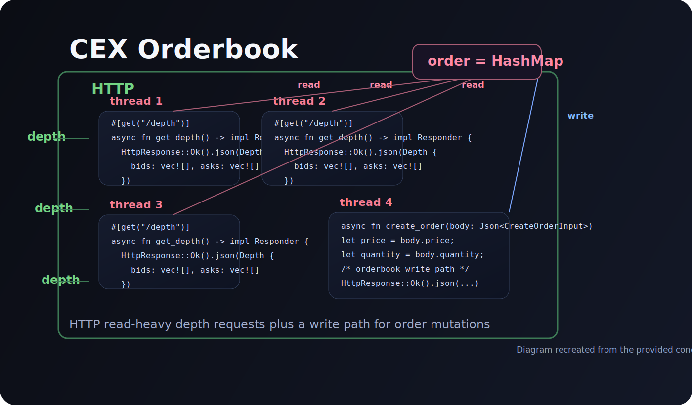

# CEX Orderbook



Rust-based centralized exchange orderbook API scaffold built with Actix Web. The project exposes a small HTTP surface for creating orders, cancelling orders, and reading market depth, with the code structured to evolve into an in-memory matching engine.

## Overview

This repository is an early backend foundation for a CEX-style orderbook service. It focuses on clean request/response handling, typed payloads with Serde, and a route layout that is simple to extend as matching, persistence, and concurrency controls are added.

Current HTTP endpoints:

- `POST /order` accepts a new order payload and echoes a created-order response.
- `DELETE /order/{id}` is wired as an order cancellation route and currently returns a placeholder response body.
- `GET /depth` returns a depth snapshot structure with bids, asks, and a `lastUpdateId`.

## Why This Project

An orderbook service is a useful systems exercise because it sits at the intersection of:

- low-latency request handling
- predictable data modeling
- concurrent reads and writes
- clean API design for trading clients

This codebase is set up as the first step toward those goals rather than a finished exchange engine.

## Tech Stack

- Rust `edition = "2024"`
- Actix Web `4.13`
- Serde for JSON serialization and deserialization

## Project Structure

```text
src/
  main.rs        # HTTP server bootstrap and route registration
  routes.rs      # REST handlers for orders and depth
  inputs.rs      # request payload types
  output.rs      # response payload types
  orderbook.rs   # initial orderbook model
```

## API

### Create Order

`POST /order`

Request body:

```json
{
  "price": 100,
  "quantity": 2,
  "user_id": 42,
  "side": "Buy"
}
```

Current response:

```json
{
  "message": "order created",
  "order": {
    "price": 100,
    "quantity": 2,
    "user_id": 42,
    "side": "Buy"
  }
}
```

### Delete Order

`DELETE /order/{id}`

The route is present and returns a placeholder cancellation summary.

Current response:

```json
{
  "failed_qty": 0,
  "average_price": 100
}
```

Note: the handler currently reads a JSON body with `order_id`, while the route path also includes `{id}`. That mismatch is a good next cleanup target.

### Get Depth

`GET /depth`

Current response:

```json
{
  "bids": [],
  "asks": [],
  "lastUpdateId": "dsfdkf"
}
```

## Local Development

### Prerequisites

- Rust toolchain installed
- Cargo available in your shell

### Run

```bash
cargo run
```

The server binds to:

```text
127.0.0.1:8080
```

### Check Build

```bash
cargo check
```

## Design Direction

The intended architecture is an in-memory orderbook with a write path for order mutations and a fast read path for depth snapshots. The cover diagram reflects that direction: multiple HTTP reader threads can serve depth requests while order creation mutates shared order state.

For the next iteration, a strong implementation path would be:

- move orderbook state into shared application state
- use `web::Data` to inject the orderbook into handlers
- separate route DTOs from core matching-engine models
- implement price-time priority matching
- maintain derived depth snapshots for faster reads
- add tests for matching, cancellation, and depth generation

## Current Status

What is already in place:

- typed request and response models
- Actix route macros and server bootstrap
- starter orderbook model
- compileable API scaffold

What is not implemented yet:

- real order insertion into the orderbook
- matching logic
- persistence
- authentication
- validation and error handling
- concurrent state management

## Roadmap

1. Introduce shared in-memory state for bids and asks.
2. Implement order insertion and cancellation against the in-memory book.
3. Add matching logic and partial-fill accounting.
4. Generate real depth snapshots from book state.
5. Add integration tests for each route.
6. Add benchmarking and concurrency validation.

## Notes

This README documents the project as it exists today, not as a fully completed exchange engine. That matters because the code is a solid foundation, but anyone cloning the repo should understand it is currently a scaffold moving toward a more complete matching system.
