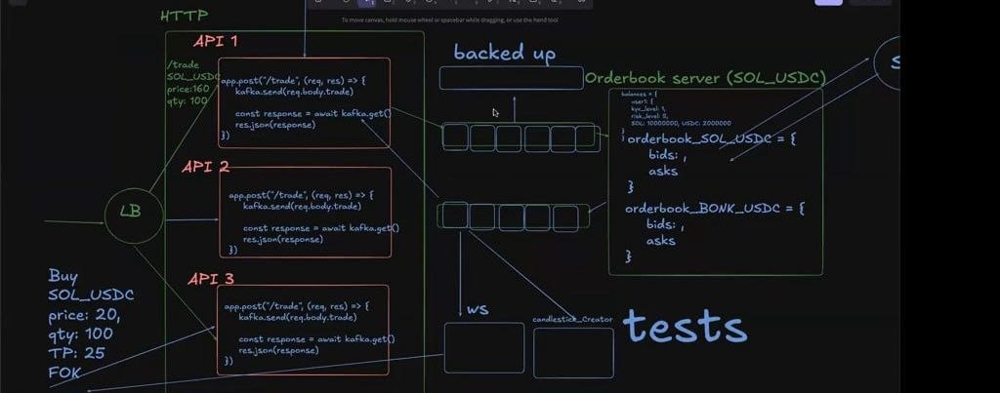

# CEX Orderbook



Small Actix Web service that exposes a starter HTTP API for a centralized-exchange-style orderbook. The project already has shared in-memory state, typed request and response models, and route handlers for order creation, order deletion, and depth reads.

This is still a prototype. The API surface exists, but the matching engine and full orderbook persistence are not finished yet.

## Current Implementation

The server boots an `Arc<Mutex<Orderbook>>` in [`src/main.rs`](src/main.rs) and injects it into the handlers in [`src/routes.rs`](src/routes.rs).

Implemented routes:

- `POST /order`
- `DELETE /order/{id}`
- `GET /depth`

Core modules:

```text
src/
  main.rs        # server bootstrap and shared state wiring
  routes.rs      # HTTP handlers
  inputs.rs      # request DTOs
  output.rs      # response DTOs used by create/delete handlers
  orderbook.rs   # in-memory orderbook data structures
```

## Tech Stack

- Rust `edition = "2024"`
- Actix Web `4.13`
- Serde and Serde JSON

## Running Locally

Prerequisites:

- Rust toolchain installed
- Cargo available in your shell

Start the server:

```bash
cargo run
```

Default bind address:

```text
127.0.0.1:8080
```

Optional verification:

```bash
cargo check
```

## API

### Create Order

`POST /order`

Request body:

```json
{
  "price": 100.0,
  "quantity": 2.5,
  "user_id": "user-1",
  "side": "Buy"
}
```

Current response shape:

```json
{
  "order_id": "0",
  "filled_quantity": 0.0,
  "remaining_quantity": 2.5,
  "average_price": 100.0
}
```

Notes:

- `order_id` is generated from an incrementing in-memory counter.
- The handler locks the shared orderbook before calling `create_order`.

### Delete Order

`DELETE /order/{id}`

Current request body:

```json
{
  "order_id": "0",
  "user_id": "user-1"
}
```

Current response shape:

```json
{
  "success": true,
  "remaining_quantity": 0.0,
  "filled_quantity": 0.0,
  "average_price": 0.0
}
```

Notes:

- The path parameter `{id}` exists in the route, but the handler currently uses the JSON body instead.
- Deletion logic currently checks only the bid side of the book.

### Get Depth

`GET /depth`

Current response shape:

```json
{
  "bids": [],
  "asks": []
}
```

Depth is built by aggregating order quantities by price level from the in-memory maps.

## Important Limitations

This README describes the code as it exists now, and there are a few gaps worth calling out clearly:

- `create_order` constructs an `OpenOrder`, but it does not currently push that order into the stored bid or ask vectors.
- Because orders are not being inserted into the book yet, `GET /depth` will remain empty during normal API usage.
- `DELETE /order/{id}` does not currently use the route id and does not remove sell-side orders.
- There is no matching engine, partial-fill logic, validation layer, persistence layer, or authentication.

## Design Direction

The structure is pointed in the right direction for a simple in-memory exchange service:

- route handlers already share a single orderbook instance
- request and response DTOs are separated from the server bootstrap
- the orderbook type is isolated for future matching and aggregation logic

The next practical steps are:

1. Store created orders inside `bids` and `asks`.
2. Make deletion use the route id or remove the unused path parameter.
3. Support deletion on both sides of the book.
4. Add matching and fill accounting.
5. Return real depth generated from persisted orders.
6. Add route and orderbook tests.

## Status

What is already in place:

- compileable Actix Web server
- shared in-memory orderbook state
- typed request and response models
- basic route wiring for create, delete, and depth

What is still missing:

- actual order storage from the create endpoint
- matching and trade execution
- robust cancellation behavior
- validation and error handling
- persistence and recovery
- tests and benchmarking
